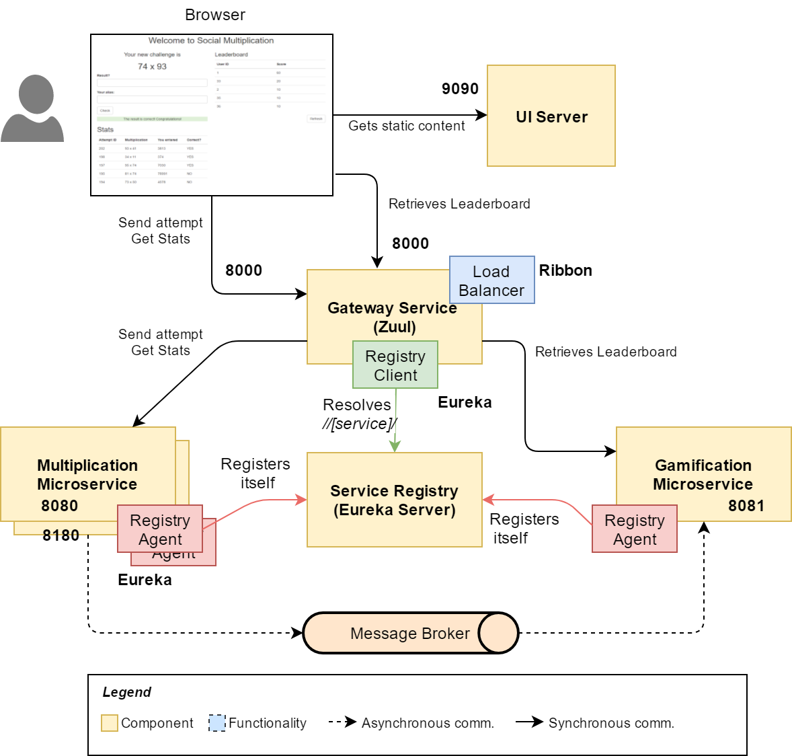

MSA 아키텍처에서 사용되는 기술들에 대한 개념 정리.
- spring cloud
- netflix zuul (api gateway)
- ribbon (load balancer)

# 목표
1. 각 서비스의 개념을 익힌다.
2. MSA 아키텍처 흐름을 익힌다.

# zuul
Zuul은 Device, Web Sites, Streaming Application 등의 모든 요청을 수신하는 Front Door 입니다.
Zuul은 Edge Service Application으로써 동적 라우팅(Dynamic Routing), 모니터링, 탄력성(확장성), 보안 등의 기능을 제공합니다.

- spring cloud zuul은 Netflix open source project인 zuul을 spring framework에서 동작하도록 만든 것.

- 2018년 12월부터 더이상의 기능 개선 없이 유지만 하는 Maintenance Mode로 변경됨
- spring boot 2.4.x부터는 zuul이 제공되지 않음(spring boot 2.3버전까지만 지원)
- spring cloud 커뮤니티에서 zuul 대신 권고하고 있는 api gateway가 spring cloud gateway 임
- 아직 zuul을 많이 사용하고 있으므로 zuul 서버 개발도 배울 필요가 있다.

- zuul이 사용하는 service discovery는 spring cloud eureka 혹은 properties 파일
- spring cloud eureka를 사용하려면 git server가 필요함. 
- properties 파일은 서버 추가 시 gateway가 구동되고 있는 서버들의 모든 파일을 일일히 수정해줘야 한다.

## zuul 사용 방법
- first service, seconde service 두개 프로젝트를 생성한다.

# Ribbon
- 어떤 애플리케이션에서 다른 애플리케이션을 호출할 때 대상 애플리케이션의 인스턴스가 하나밖에 없다면, 인스턴스가 죽거나 http hang이 걸렸을 때 서비스 장애가 발생한다.
- 그래서 보통 애플리케이션 인스턴스는 최소 2개 이상을 띄운다.
- 이때 load balancer를 이용하여 인스턴스들을 연결한다.(web 서버 이중화)
- ribbon은 load balancing을 요청 애플리케이션 단에서 수행해주는 client-side load balancer
- ribbon과 같은 L/B가 필요한 이유는 부하 분산을 적절하게 하여 서비스 가용량을 최대화하기 위함
- api gateway도 ribbon을 통해 backend service를 로드밸런싱 함.
- ribbon을 사용하면 api gateway없이 대상 애플리케이션을 직접 로드 밸런싱하여 연결할 수도 있다.
    - spring cloud framework를 이용하면 보통 load balancer는 api gaetway 내에 embed 된다.
    - api gateway를 거치지 않고 직접 api 제공 애플리케이션을 호출하는 경우는 요청 애플리케이션에 embed 된다.

- 넷플릭스에서 Spring 재단에 기부한 프로젝트
- 서비스를 이름으로 호출하며 health check를 통해 load balancer 기능을 제공
- 하지만 ribbon은 비동기 방식이 적용되어있지 않은 서비스이므로 최근에는 많이 사용되지 않음
- Spring Cloud Loadbalancer로 대체 가능
- client에서 gateway로 요청하는 로직이 아니라 client 자체에서 서비스 이름을 부르도록 하는 로직

# Eureka
- MSA의 핵심 원칙 중 하나인 Service Discovery 역할 수행
- MSA에서는 각 서비스별 애플리케이션이 나뉘어 있는데 각 애플리케이션 간의 통신을 위해 서로의 연결 정보(IP, hostname, port)를 알아야 함.
- 이 연결 정보를 로드밸런서에 등록하게 됨
- MSA를 클라우드에 구축 시 연결 정보가 계속해서 변경이 됨. 이때마다 로드밸런서의 설정을 바꿔야하기 때문에 eureka가 등장함.
- eureka는 클라우드 환경에서의 연결정보의 등록과 해지를 바로 적용할 수 있게 해줌. 
- MSA에서 각 서비스들은 유레카 클라이언트임
- 유레카 클라이언트들은 스스로를 유레카 서버에 등록함(설정 값 필요)
- 유레카 클라이언트들은 자신들의 연결 정보(ip, hostname, port)의 meta data를 유레카 서버에 등록
- 유레카 클라이언트들은 유레카 서버에 저장된 registry 정보를 수신하고 자신의 로컬 환경에 저장
- 유레카 클라이언트들은 유레카 서버에게 전달받은 registry 정보를 통해 다른 클라이언트들의 정보를 알 수 있음 